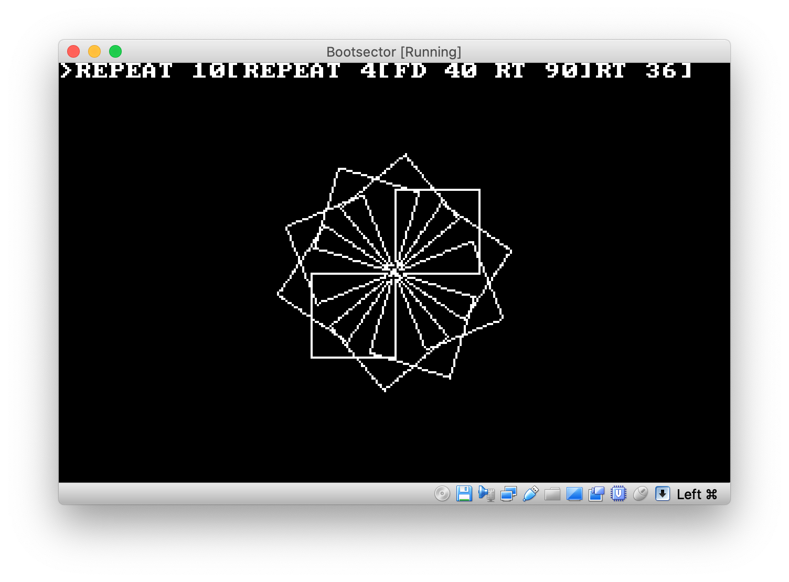
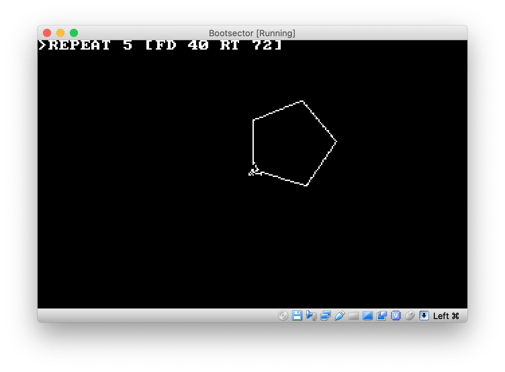

     _                 _   _
    | |               | | | |
    | |__   ___   ___ | |_| |     ___   __ _  ___
    | '_ \ / _ \ / _ \| __| |    / _ \ / _` |/ _ \
    | |_) | (_) | (_) | |_| |___| (_) | (_| | (_) |
    |_.__/ \___/ \___/ \__\_____/\___/ \__, |\___/
                                    __/ |
                                   |___/
### bootLogo interpreter in 512 bytes (boot sector or COM file)

*by Oscar Toledo G. Mar/18/2024*

http://nanochess.org

https://github.com/nanochess

This is a small interpreter of Logo language.

It's compatible with the 8088 processor (the original IBM PC), and it even works on CGA mode!

If you want to assemble it, you must download the Netwide Assembler (NASM) from www.nasm.us

Use this command line:

    nasm -f bin bootlogo.asm -Dcom_file=1 -o bootlogo.com
    nasm -f bin bootlogo.asm -Dcom_file=0 -o bootlogo.img

Tested with VirtualBox for macOS running Windows XP running this interpreter, it also works with DOSBox and probably with QEMU:

    qemu-system-x86_64 -fda bootlogo.img

You can set also the following labels:

* video_mode. This sets the video mode used for bootLogo (default = 4 for CGA mode 320x200x4 colors). A good alternative is 13 (EGA/VGA 320x200x16 mode).
* color1. This sets the color for the letters in the command line (default = 1 for CGA mode)
* color2. This sets the color for line drawing (default = 3 for CGA mode)

Enjoy it!

## User's manual

Line entry is done with the keyboard, finish the line with Enter.

Backspace can be used to correct mistakes.

The following commands are implemented:

### CLEARSCREEN

Clears the screen and returns the turtle to the center, and pointing to the north. This command can only be used alone.

### FD 40

Move the turtle 40 pixels ahead. Caveat: If you use zero, it will be taken as 65536 pixels.

### BK 40

Move the turtle 40 pixels backward. Caveat: If you use zero, it will be taken as 65536 pixels.

### RT 25

Rotate the turtle  25 degrees clockwise.

### LT 25

Rotate the turtle 25 degrees counterclockwise.

### REPEAT 10 FD 10

Repeat 10 times FD 10

### REPEAT 10 [FD 10 RT 20]

Repeat 10 times FD 10 RT 20. Repeat can be nested. If you miss the final ] character then bootLogo will crash.

### PU

Pen up. The turtle doesn't draw for following commands.

### PD

Pen down. The turtle draws again.

### SETCOLOR 2

Set color for pen. Only 0-3 available in CGA, and 0-15 for EGA/VGA.

### QUIT

Exit to command line (only .COM version)

## Examples

## Acknowledgments

* jcmeyrignac for an idea to make smaller the number decoding.
* Jim Leonard (MobyGamer) for making me thinking about a higher-precision sin function, and suggesting me the use of the Set Pixel BIOS service.
* raulamd for reminding me that cubicDoom had a smaller sin function.

## More on this?

Do you want to learn 8086/8088 assembler? Get my book Programming Boot Sector Games containing an 8086/8088 crash course!

Now available from Lulu:

[Paperback book](http://www.lulu.com/shop/oscar-toledo-gutierrez/programming-boot-sector-games/paperback/product-24188564.html)

[Hard-cover book](http://www.lulu.com/shop/oscar-toledo-gutierrez/programming-boot-sector-games/hardcover/product-24188530.html)

[eBook](https://nanochess.org/store.html)

These are some of the example programs documented profusely
in the book:

  * Guess the number.
  * Tic-Tac-Toe game.
  * Text graphics.
  * Mandelbrot set.
  * F-Bird game.
  * Invaders game.
  * Pillman game.
  * Toledo Atomchess.
  * bootBASIC language.
